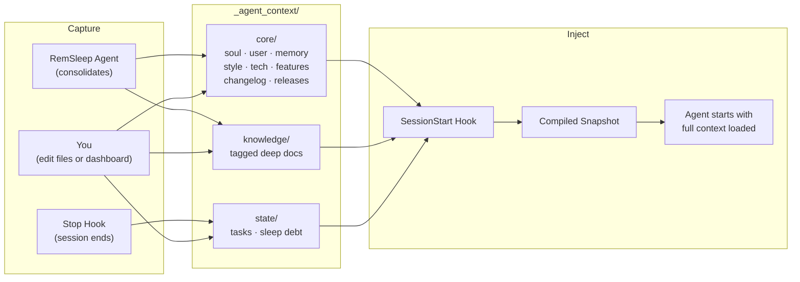

<p align="center">
  
</p>

<h1 align="center">agentcontext</h1>

<p align="center">
  Structured, persistent context for AI coding agents.<br/>
  Pre-loaded via hooks. Zero tool calls to get started.
</p>

<p align="center">
  <a href="#why">Why</a> &nbsp;&middot;&nbsp;
  <a href="#how-it-works">How It Works</a> &nbsp;&middot;&nbsp;
  <a href="#quick-start">Quick Start</a> &nbsp;&middot;&nbsp;
  <a href="#dashboard">Dashboard</a> &nbsp;&middot;&nbsp;
  <a href="#commands">Commands</a> &nbsp;&middot;&nbsp;
  <a href="DEEP-DIVE.md">Deep Dive</a>
</p>

> **Under active development.** APIs and commands may change before v1.0.

---

## Why

AI coding agents are powerful, but they make real mistakes. They fetch entire collections instead of filtering at the query level. They write serverless functions with infinite loop potential. They optimize for making the test pass, not making the system correct.

A human needs to be steering. But steering only works when both you and the agent are looking at the same context: what decisions were made, what is in progress, what rules to follow.

And every session starts from scratch. Your agent greps for a decision it already made yesterday. Reads a few files. Searches again. Pieces together context it already had. By the time it says "Ok, I understand the codebase," you haven't started working yet. This happens every session, and it gets worse as your project grows.

`agentcontext` fixes both problems. It gives your agent structured, pre-loaded context before the first message, and gives you readable files you can open, audit, and correct. **Context that both you and your agent can act on.**

<table>
<tr>
<td width="50%" align="center">
<br/>
<em><strong>Without agentcontext</strong><br/>Search, read, search again.<br/>Tokens burned on re-discovery.</em>
</td>
<td width="50%" align="center">
<br/>
<em><strong>With agentcontext</strong><br/>Context pre-loaded via hook.<br/>Zero tool calls. Straight to work.</em>
</td>
</tr>
</table>

> **Want the full story?** Philosophy, architecture, and every design tradeoff explained. **[Read the deep dive &rarr;](DEEP-DIVE.md)**

## How It Works



- **Hooks capture context automatically.** Stop hook records what happened. SessionStart hook injects everything before the agent's first message. SubagentStart hook briefs sub-agents on existing knowledge.
- **Files are structured by purpose.** Identity, preferences, decisions, knowledge, and active work each live in their own file with their own format.
- **Sleep cycles consolidate knowledge.** A RemSleep agent promotes learnings, extracts docs, cleans stale entries, and resets debt.
- **Everything is local markdown and JSON.** Readable, editable, git-tracked, owned by you.

## Quick Start

```bash
npm install -g agentcontext
```

> Requires **Node.js >= 18**. Currently supports **Claude Code**.

```bash
# 1. Initialize the context structure
agentcontext init

# 2. Install the Claude Code integration (skill, agents, hooks)
agentcontext install-skill
```

Two commands. Next session, the hook fires, context loads, and the agent is ready.

### Interactive mode

Run `agentcontext` with no arguments to enter interactive mode with a visual menu for all commands.

### What gets created

```
your-project/
├── _agent_context/              # Structured context (git-tracked)
│   ├── core/
│   │   ├── 0.soul.md           # Identity, principles, rules
│   │   ├── 1.user.md           # Your preferences, project details
│   │   ├── 2.memory.md         # Decisions, issues, learnings
│   │   ├── 3.style_guide.md    # Style & branding
│   │   ├── 4.tech_stack.md     # Tech decisions
│   │   ├── 5.data_structures.sql
│   │   ├── CHANGELOG.json
│   │   ├── RELEASES.json
│   │   └── features/           # Feature PRDs
│   ├── knowledge/              # Tagged docs (index in snapshot)
│   │   └── *.md                # pinned: true → auto-loaded in full
│   └── state/                  # Active tasks, sleep state
│       └── .sleep.json
│
├── .claude/
│   ├── skills/agentcontext/
│   │   └── SKILL.md            # Teaches the agent the system
│   ├── agents/
│   │   ├── agentcontext-initializer.md
│   │   └── agentcontext-rem-sleep.md
│   └── settings.json           # SessionStart + Stop + SubagentStart hooks
```

## Dashboard

```bash
agentcontext dashboard                   # Open at localhost:4173
agentcontext dashboard --port 8080       # Custom port
agentcontext dashboard --no-open         # Start without opening browser
```

A local web UI for managing agent context visually. Built with React 19, served by a zero-dependency Node HTTP server. Ships in the npm package.

<table>
<tr>
<td width="50%">

**Kanban board** with drag-and-drop, filtering by priority/tags, sorting, and grouping. Create tasks, update status, add changelog entries from a detail panel.

</td>
<td width="50%">

**Core editor** with split-pane markdown editing and live preview. Knowledge manager with search and pin/unpin. Feature PRD viewer. SQL ER diagram preview.

</td>
</tr>
<tr>
<td width="50%">

**Sleep tracker** showing debt gauge, session history timeline, and a list of every manual change made through the dashboard.

</td>
<td width="50%">

**Change tracking** records every dashboard action to `.sleep.json` so the agent knows what you changed between sessions and consolidates it during sleep.

</td>
</tr>
</table>

Light and dark mode with system preference detection. Brand palette: purple-to-magenta gradient. Visby CF font with system font fallback.

## Commands

### Core

```bash
agentcontext core changelog add           # Add changelog entry
agentcontext core releases add            # Create release with auto-discovery
agentcontext core releases add --yes      # Non-interactive, include all unreleased items
agentcontext core releases list           # List recent releases
agentcontext core releases show <version> # Show release details
```

Release creation auto-discovers unreleased tasks, features, and changelog entries. Back-populates `released_version` on included features.

### Tasks

```bash
agentcontext tasks create <name>          # Create a task
agentcontext tasks create <name> --priority high --status in_progress --tags "api,auth"
agentcontext tasks log <name> <content>   # Log progress (newest first)
agentcontext tasks insert <name> <section> <content>  # Insert into a named section
agentcontext tasks complete <name>        # Mark completed
```

All flags (`--description`, `--priority`, `--status`, `--tags`, `--why`) are optional. Defaults to medium priority and todo status, so the command works non-interactively for agent use.

### Features

```bash
agentcontext features create <name>       # Create a feature PRD
agentcontext features insert <name> <section> <content>
```

### Knowledge

```bash
agentcontext knowledge create <name>      # Create a knowledge doc
agentcontext knowledge index              # List all with descriptions + tags
agentcontext knowledge index --tag api    # Filter by tag
agentcontext knowledge tags               # List standard tags
```

Set `pinned: true` in frontmatter to auto-load a knowledge file in every snapshot.

### Sleep

Sleep debt is tracked automatically via hooks. Manual commands for edge cases:

```bash
agentcontext sleep status                # Debt level, sessions, last sleep
agentcontext sleep add <score> <desc>    # Add debt manually
agentcontext sleep done <summary>        # Complete consolidation, reset
agentcontext sleep debt                  # Raw number (for scripts)
```

### Dashboard

```bash
agentcontext dashboard                   # Start the web dashboard
```

### System

```bash
agentcontext hook session-start          # SessionStart hook output
agentcontext hook stop                   # Stop hook: capture + score
agentcontext hook subagent-start         # SubagentStart hook output
agentcontext snapshot                    # Snapshot only (no hook processing)
agentcontext snapshot --tokens           # Estimated token count
agentcontext doctor                      # Validate structure
agentcontext install-skill               # Install Claude Code integration
```

## Design Principles

- **Structure over volume** -- organized context beats more context
- **Pre-loaded, not searched** -- memory injected before the first message
- **Consolidation built in** -- sleep cycles keep context sharp, not bloated
- **Agent-native** -- designed for how LLMs consume context
- **Owned by you** -- plain markdown and JSON in your repo

## Works With

- **Claude Code**: full support via skill, sub-agents, and hooks
- **Web Dashboard**: local UI for visual context management (ships in the package)

More agents coming soon.

## License

MIT

## Acknowledgements

The memory system draws partial inspiration from [OpenClaw](https://github.com/openclaw/openclaw)'s approach to agent memory. The brain-region architecture, sleep consolidation cycle, and CLI-first design are my own, built from months of working with AI coding agents on real projects.
