<p align="center">
  
</p>

<h1 align="center">agentcontext</h1>

<p align="center">
  <strong>A structured brain for AI coding agents.</strong><br/>
  Local files. Filesystem speed. No API calls. No detours.<br/>
  Built for solo developers who ship with AI.
</p>

<p align="center">
  <a href="#the-real-problem">The Problem</a> &nbsp;&middot;&nbsp;
  <a href="#why-existing-solutions-break">Why Others Break</a> &nbsp;&middot;&nbsp;
  <a href="#the-approach">The Approach</a> &nbsp;&middot;&nbsp;
  <a href="#tradeoffs">Tradeoffs</a> &nbsp;&middot;&nbsp;
  <a href="#built-for-solo-developers">For Solo Devs</a> &nbsp;&middot;&nbsp;
  <a href="#install">Install</a>
</p>

> **This project is under active development.** APIs, file formats, and commands may change before v1.0. Feedback and contributions are welcome.

---

## The Real Problem

Your agent can remember things. That part is already solved. `CLAUDE.md`, `AGENT.md`, built-in memory features. **The basics are covered.**

But here's what actually happens when your project gets real.

You ask the agent to work on a task. The task references something, maybe a caching strategy you decided on two weeks ago. One paragraph. A clear decision that already lives somewhere in your project. But the agent doesn't know that. So it starts digging.

It greps for "cache." Finds 14 matches across 8 files. Reads 3 of them. Realizes those are implementation files, not the decision. Searches for "strategy." Reads 2 more files. Finds a comment that references a config pattern. Reads the config. Now it searches for where that config is used. Reads 2 more files. Finally pieces it together.

**Three minutes. Eight tool calls. Context window already at +30%.** And then it says: *"Ok, now I completely understand the codebase. Let me plan the implementation."*

You haven't started working yet. You've been watching your agent do archaeology on a decision **it already knew yesterday**.

```
Session starts
  → Agent reads CLAUDE.md                          knows the basics
  → You mention a task                             references a past decision
  → Agent searches... reads... searches again      8+ tool calls, 20K+ tokens
  → "I now understand the codebase"                minutes later, context at 30%
  → Starts planning                                you're still waiting
```

This happens **every session**. The same exploration spiral. And it scales with your project. More files, more decisions, more things to re-discover. The memory file either balloons into a wall of text the agent skims past, or stays shallow enough that it doesn't help. Either way, the agent ends up searching.

**You're paying for search, not for work.**

<p align="center">
  <br/>
  <em>Without agentcontext: the agent burns tokens re-exploring its own project every session</em>
</p>

## Why Existing Solutions Break

### Single memory files don't scale

A `CLAUDE.md` is great for small projects. "Use tabs. Prefer functional. API is in `/src/api`." **That works when your project is simple.**

But when you've got 200 files, 15 active decisions, 3 in-progress features, and a deployment process with edge cases, **one file either balloons into a 2000-line monster** the agent skims past, or it stays shallow enough to be useless.

Think about your own brain. You don't keep everything in one place. You have **regions**. Spatial awareness, muscle memory, facts, personal experiences. They're organized differently because they serve different purposes. A memory system for agents should work the same way.

### Search doesn't solve structural problems

It doesn't matter how your agent searches. Grep, glob, fuzzy match, RAG, vector store, terminal commands. **The search technology isn't the problem.** The problem is that search is the wrong approach for baseline context.

Every time your agent greps for a function, reads a file to remember a decision, or globs for config files to understand the project structure, **it's spending tokens**. Tool calls, output parsing, reasoning about what to search next. Whether that's a local `rg` call or a vector similarity query, the cost is the same: **tokens and time burned on re-discovery** instead of actual work.

Your agent shouldn't need to search for who it is, what it's working on, or what decisions were already made. That's not a search problem. **That's baseline context that should already be there** when the session starts.

The write side has the same issue. Telling an agent "save this to memory" doesn't help if **everything lands in the same pile**. Adding a technical decision, logging task progress, registering a reusable component. These are **structurally different operations**. They belong in different places with different formats. A flat append to a single file, or a generic insert into any store, can't express that difference.

And when it comes time to retrieve, **structure is what makes the difference** between a clean answer and noise. "What are my active tasks?" is a directory listing, not a search query. "What does the soul file say about error handling?" is a file read, not a fuzzy match across everything. When your context is structured, you don't need clever retrieval. **You just go to the right place.**

### Closed memory systems lock you out

Some tools offer built-in memory behind their API. You **can't see** what your agent "knows." You **can't version-control** it. You **can't edit** it when the agent gets something wrong. And when you switch tools, or the service changes, **that knowledge disappears**.

Your agent's memory should be **files in your repo**. Markdown and JSON. Readable, editable, diffable. You should be able to open your agent's understanding of your project in any text editor, fix a wrong assumption, and commit the change. **That's ownership.**

## The Approach

### Inspired by how brains actually work

Some of the best ideas in computer science came from biology. **Neural networks** from neurons. **Genetic algorithms** from evolution. I took inspiration from how human brains **organize and consolidate memory**.

Your brain doesn't dump everything into one region. It has structure. Your **prefrontal cortex** handles identity and decision-making. Your **temporal lobe** stores facts and relationships. You have **procedural memory** for skills you don't think about, and **working memory** for what you're actively doing right now. Different types of knowledge, different storage.

`agentcontext` works the same way:

| Brain | agentcontext | What it holds |
|---|---|---|
| Prefrontal cortex | `0.soul.md` | Identity, principles, rules, constraints |
| Episodic memory | `1.user.md` | Your preferences, project conventions, workflow |
| Semantic memory | `2.memory.md` | Decisions, known issues, technical context |
| Sensory cortex | `3.style_guide.md`, `4.tech_stack.md` | Style, tech stack, data structures (with summaries in snapshot) |
| Long-term knowledge | `knowledge/` | Deep docs, tagged with standard categories, pinnable for auto-loading |
| Working memory | `state/` | Active tasks, in-progress work |

The `_agent_context/` directory is **the agent's brain**. It's structured, it's yours, and it lives in your repo.

### Context loading without tool calls

Here's the core insight: **don't make the agent search for its own context.**

`agentcontext` uses three hooks that run in the shell. A **Stop hook** captures the agent's last message, analyzes the transcript for file changes, and scores sleep debt immediately when the session ends. A **SessionStart hook** fires before the agent sees your first message and injects a compiled context snapshot. A **SubagentStart hook** injects a lightweight briefing into every sub-agent (Explore, Plan, etc.) so they know about existing knowledge and project context before exploring blindly.

- **Soul + User + Memory** loaded in full
- **Extended core files** (style guide, tech stack, data structures) surfaced as summaries with paths
- **Active tasks, sleep state, recent changelog**
- **Features summary** with Why, related tasks, and latest changelog entry per feature
- **Knowledge index** with descriptions and tags for every knowledge file
- **Pinned knowledge** loaded in full for files marked as critical

```
Session ends
  → Stop hook fires                                  runs in shell
  → Captures last assistant message + transcript     what the agent accomplished
  → Analyzes file changes, scores debt immediately   no deferred analysis
  → Session record saved to .sleep.json              full context preserved

Next session starts
  → SessionStart hook fires                          runs in shell
  → Context injected: soul + user + memory +         zero tool calls
    core summaries + tasks + sleep state +
    last session summary + per-session history +
    features (why + tasks + latest) +
    changelog + knowledge index + pinned docs
  → You ask your question.
  → Agent is already at full capacity.
```

Let's be honest: **this still consumes tokens.** The snapshot is injected into the context window, and as your project grows, it gets larger. But the tradeoff is clear. Without it, the agent burns 20K+ tokens and several minutes on search loops just to reach the same understanding. With it, the agent starts with structured context and zero tool calls. For complex projects, the savings in tokens, time, and context window space add up fast.

We're planning to publish benchmarks comparing token usage, time-to-first-useful-action, and context window consumption with and without `agentcontext` across projects of different sizes. Numbers, not claims.

Every file's path is included in the snapshot, so if the agent needs more detail on something, it knows exactly where to look. One targeted read, not a search spiral.

### The sleep cycle: how agents learn

Here's something we take for granted. Humans **consolidate memory during sleep**. Your hippocampus replays the day, extracts patterns, strengthens important connections, and discards noise. Without sleep, memory falls apart. It's not optional. It's how learning works.

Agents face the exact same challenge. Over a session, your agent accumulates knowledge. Decisions, patterns, problems solved, tasks completed. **Without consolidation**, that knowledge either gets lost when the session ends or piles up in context files until they're too noisy to be useful.

So I gave the agent a sleep cycle.

`agentcontext` ships with a **RemSleep** agent that consolidates what was learned:

1. **Debt accumulates automatically.** The **Stop hook** captures the agent's last message (what it accomplished), analyzes the transcript for file changes (Write/Edit tool uses), scores debt immediately (1-3 changes = +1, 4-8 = +2, 9+ = +3), and saves a full session record. Each session is tracked independently, so **multiple concurrent sessions** each get their own entry. No manual tracking needed
2. **Every session is preserved.** The sleep state maintains a sessions array (newest first). Each record holds the session ID, transcript path, timestamp, change count, debt score, and the full text of the agent's last message. The RemSleep agent reads these to understand exactly what happened across sessions without parsing raw transcripts
3. **The agent responds with graduated awareness.** At **Alert** (0-3), it works normally. At **Drowsy** (4-6), it mentions consolidation at natural breaks. At **Sleepy** (7-9), it actively suggests sleeping and the snapshot includes a reminder. At **Must Sleep** (10+), the snapshot injects a critical directive and the agent consolidates before new work
4. **RemSleep consolidates.** Promotes learnings to core files, extracts knowledge into tagged docs, updates summaries, cleans stale entries, keeps files lean
5. **Debt resets.** After consolidation, debt goes to zero, sessions are cleared, the timestamp is recorded, and the cycle starts fresh
6. **Next session**, the agent wakes up knowing its debt level, when it last consolidated, and a summary of what the previous session accomplished

This is **progressive learning**. The agent doesn't just remember. It **refines**. Each cycle, its understanding gets more structured, more precise. And because sleep debt is tracked as real state (not just a behavioral prompt), the system actually enforces consolidation instead of hoping the agent remembers to do it.

<p align="center">
  <br/>
  <em>With agentcontext: the agent wakes up with structured knowledge, ready to work</em>
</p>

## Lifecycle

```mermaid
flowchart TD
    INIT["<b>agentcontext init</b><br/>Scan codebase, ask questions,<br/>create _agent_context/"]
    BRAIN["<b>_agent_context/</b><br/>core/ · knowledge/ · state/<br/>The agent's structured brain<br/><i>Version-controlled. Owned by you.</i>"]

    WAKE["<b>1. Wake Up</b><br/>Stop hook already captured last session<br/>with message, changes, and debt score<br/>SessionStart injects full context snapshot<br/>+ per-session history + knowledge index<br/><i>0 tool calls · 0 search</i>"]
    WORK["<b>2. Work</b><br/>Agent works with full context<br/>Paths included, reads more if needed<br/>CLI commands for structural ops"]
    ACCUMULATE["<b>3. Accumulate</b><br/>Decisions made, patterns found,<br/>tasks progress, knowledge grows<br/><i>Alert → Drowsy → Sleepy → Must Sleep</i>"]

    SLEEP["<b>4. Sleep</b><br/>RemSleep agent activates<br/>Auto at Must Sleep (10+) or by user"]
    CONSOLIDATE["<b>5. Consolidate</b><br/>Promote learnings to core files<br/>Tag + extract knowledge to docs<br/>Update core file summaries<br/>Reset debt, record timestamp"]
    CLEANUP["<b>6. Clean Up</b><br/>Archive completed tasks<br/>Remove stale entries<br/>Keep files lean and focused"]

    BETTER["<b>Next Session</b><br/>Agent wakes up knowing its debt,<br/>last sleep, and what changed since.<br/><i>Progressive learning.</i>"]

    INIT --> BRAIN
    BRAIN --> WAKE
    WAKE --> WORK
    WORK --> ACCUMULATE
    ACCUMULATE --> SLEEP
    SLEEP --> CONSOLIDATE
    CONSOLIDATE --> CLEANUP
    CLEANUP --> BETTER
    BETTER -.->|"cycle repeats"| WAKE

    style INIT fill:#2d333b,stroke:#539bf5,color:#adbac7
    style BRAIN fill:#1c2128,stroke:#57ab5a,color:#adbac7
    style WAKE fill:#2d333b,stroke:#57ab5a,color:#adbac7
    style WORK fill:#2d333b,stroke:#57ab5a,color:#adbac7
    style ACCUMULATE fill:#2d333b,stroke:#daaa3f,color:#adbac7
    style SLEEP fill:#2d333b,stroke:#986ee2,color:#adbac7
    style CONSOLIDATE fill:#2d333b,stroke:#986ee2,color:#adbac7
    style CLEANUP fill:#2d333b,stroke:#986ee2,color:#adbac7
    style BETTER fill:#1c2128,stroke:#57ab5a,color:#adbac7
```



### Token-efficient CLI

Instead of making the agent read, parse, and rewrite structured files (burning tokens and risking format errors), the CLI handles **structural operations in a single call**:

```bash
agentcontext tasks create auth-refactor     # Scaffolds task with frontmatter
agentcontext tasks log auth-refactor "..."  # Appends log entry (LIFO)
agentcontext core changelog add             # Adds entry with proper schema
agentcontext features insert auth changelog "Added OAuth flow"  # LIFO section insert
```

**One CLI call** replaces a Read + think + Edit + verify cycle. That difference compounds fast over a session.

## What Changes

| | Without agentcontext | With agentcontext |
|---|---|---|
| **Session start** | 20K+ tokens burned on search and exploration | Context **pre-loaded via hook**, fewer tool calls to get oriented |
| **Project growth** | Memory file becomes an unmanageable wall of text | **Structured** across purpose-built files with size limits |
| **Knowledge retention** | Decisions get buried or lost between sessions | **Consolidated** during tracked sleep cycles with per-session context, tagged and discoverable |
| **Knowledge discovery** | Agent doesn't know what docs exist unless it searches | **Knowledge index** auto-loaded with descriptions, tags, and paths |
| **Context ownership** | Locked behind vendor APIs or scattered in flat files | **Git-tracked** markdown and JSON you fully control |
| **Token efficiency** | Thousands of tokens wasted on re-discovery | **CLI** for structural ops, **hooks** for zero-cost loading |
| **Scaling** | Falls apart as the project gets complex | **Built to scale**: knowledge extraction, standard tags, pinning |

## Tradeoffs

| I chose | Over | Why |
|---|---|---|
| **Local files** | Jira, Linear, GitHub APIs via MCP | Agents fumble with MCP tool descriptions, retry API calls, parse unexpected responses. `Read` on a local file never fails. Filesystem speed beats network speed. |
| **Smart pre-loading** | On-demand search | A structured snapshot once is cheaper than 20K tokens of search loops. Soul, user, memory load in full. Everything else loads as summaries with paths, so the agent knows where to look without reading everything. |
| **Opinionated structure** | Flexible layout | The snapshot knows where everything lives because it's always in the same place. Flexibility means discovery, discovery means search, search means tokens. |
| **JSON changelogs** | Markdown or git log | JSON is the agent's native format. Discrete fields, instant parsing, one CLI call to append. No format guessing, no commit message interpretation. |
| **Keyword search** | Semantic/vector search | Zero dependencies, instant, predictable. Dozens of context files don't need embeddings. |
| **CLI for structure** | Agent editing JSON/frontmatter directly | One CLI call beats a Read + reason-about-format + Edit + verify cycle. Simple content edits still use `Read`/`Edit`/`Write` directly. |
| **Hooks over prompts** | Instructions in CLAUDE.md | Context bloat degrades LLM performance across the board, especially instruction following. I tested this across multiple projects: when sleep debt tracking lived in prompt instructions, the agent forgot to call RemSleep most of the time. Hooks run outside the context window, so debt scoring, session capture, and consolidation triggers happen consistently regardless of how full the window is. |
| **Upfront context cost** | Nothing until needed | For small projects, the snapshot may consume more tokens than searching would. But your project is never a black box. The agent always knows what exists, what was decided, and where to look. That pays off the moment your project stops being small. |
| **Claude Code first** | All agents at once | Starting where the hook and tool ecosystem is richest. More agents coming as I expand. |

## Built for Solo Developers

AI agents might not deploy your production code tomorrow. But solo developers shipping real products with AI tools? **That's already happening.**

The person using `agentcontext` is a one-person army. They don't need Jira with role-based access control and sprint planning for a team of one. They don't need a project management platform that costs $15/seat when there's one seat. They need their agent to know the project, track work, and move fast.

That's why everything lives in files. A solo developer's project management tool is their repo. Their changelog is a JSON file the agent reads in one call. Their task board is a directory the agent lists in one glob. Their knowledge base is markdown files the agent searches with grep. **No context switching. No platform hopping. No waiting for API responses.**

When your agent can touch its own context at filesystem speed, something changes. It stops being a tool you prompt and starts being a partner that knows the project. It tracks its own tasks. It consolidates what it learned. It wakes up tomorrow ready to continue where it left off.

**This is vibe coding on steroids.** Your agent doesn't just write code. It understands the project, remembers decisions, manages its own work, and gets sharper every session. All at the speed of reading a file.

## Install

```bash
npm install -g agentcontext
```

> Requires **Node.js >= 18**. Currently supports **Claude Code**. Multi-agent support is planned.

## Quick Start

```bash
# 1. Initialize the agent's brain for your project
agentcontext init

# 2. Install the Claude Code integration (skill, agents, hooks)
agentcontext install-skill
```

That's it. **Two commands.** Next time Claude Code starts a session, the hook fires, context loads, and the agent is ready to work.

### What gets created

```
your-project/
├── _agent_context/              # The agent's brain (git-tracked)
│   ├── core/
│   │   ├── 0.soul.md           # Identity, principles, rules
│   │   ├── 1.user.md           # Your preferences, project details
│   │   ├── 2.memory.md         # Decisions, issues, learnings
│   │   ├── 3.style_guide.md    # Style & branding (summary in snapshot)
│   │   ├── 4.tech_stack.md     # Tech decisions (summary in snapshot)
│   │   ├── 5.data_structures.sql
│   │   ├── CHANGELOG.json
│   │   ├── RELEASES.json
│   │   └── features/           # Feature PRDs
│   ├── knowledge/              # Tagged knowledge docs (index in snapshot)
│   │   └── *.md                # pinned: true → full content in snapshot
│   └── state/                  # Active tasks
│       └── .sleep.json         # Sleep debt, per-session records with messages
│
├── .claude/
│   ├── skills/agentcontext/
│   │   └── SKILL.md            # Teaches the agent the system
│   ├── agents/
│   │   ├── agentcontext-initializer.md
│   │   └── agentcontext-rem-sleep.md
│   └── settings.json           # SessionStart + Stop + SubagentStart hooks
```

## Commands

### Core Files

```bash
agentcontext core changelog add           # Add changelog entry (interactive)
agentcontext core releases add            # Add release entry (interactive)
```

### Tasks

```bash
agentcontext tasks create <name>          # Create a task
agentcontext tasks log <name> <content>   # Log progress (LIFO)
agentcontext tasks complete <name>        # Mark completed
```

### Features

```bash
agentcontext features create <name>       # Create a feature PRD
agentcontext features insert <name> <section> <content>  # Insert into section
```

### Knowledge

```bash
agentcontext knowledge create <name>      # Create a knowledge doc
agentcontext knowledge index              # List all knowledge files with descriptions
agentcontext knowledge index --tag api    # Filter by standard tag
agentcontext knowledge tags               # List standard knowledge tags
```

Knowledge files support **pinning**: set `pinned: true` in a file's frontmatter and its full content loads in every session snapshot. Standard tags (`architecture`, `api`, `frontend`, `backend`, `database`, `devops`, `security`, `testing`, `design`, `decisions`, `onboarding`, `domain`) help agents categorize and filter knowledge.

Reading and searching context files is done with the agent's native tools (Read, Grep, Glob) directly on the `_agent_context/` directory.

### Sleep

Sleep debt is **tracked automatically** via hooks. The Stop hook captures the agent's last message, analyzes file changes, and scores debt immediately. Each session is saved as a full record with context. Manual tracking is only needed for non-file-change work.

```bash
agentcontext sleep status                # Current debt, level, sessions, last sleep
agentcontext sleep add <score> <desc>    # Manual override for discussions/decisions
agentcontext sleep done <summary>        # Mark consolidation complete, reset debt
agentcontext sleep debt                  # Output raw debt number (for scripts)
```

### System

```bash
agentcontext hook session-start           # SessionStart hook: inject context snapshot
agentcontext hook stop                    # Stop hook: capture message, analyze, score debt
agentcontext hook subagent-start          # SubagentStart hook: inject briefing into sub-agents
agentcontext snapshot                     # Output snapshot only (no hook processing)
agentcontext snapshot --tokens            # Show estimated token count of snapshot
agentcontext doctor                       # Validate _agent_context/ structure
agentcontext install-skill                # Install Claude Code integration
```

## Design Principles

- **Structure over volume**: organized context beats more context
- **Pre-loaded context**: the agent's memory is injected before the first message, zero tool calls
- **Anti-bloat**: automatic cleanup, consolidation, and size limits so context stays sharp
- **Agent-native**: designed for how LLMs consume context, not how humans browse docs
- **Owned by you**: plain markdown and JSON, version-controlled in your repo
- **Biology-inspired**: structured regions, sleep consolidation, progressive learning

## Works With

- **Claude Code**: full support via skill, sub-agents, and hooks (SessionStart, Stop, SubagentStart)

More agents coming soon.

## Acknowledgements

The memory system in agentcontext draws partial inspiration from [OpenClaw](https://github.com/openclaw/openclaw)'s approach to agent memory. However, the core of this project evolved from my own context management practices built up over many sessions of working with AI coding agents. The brain-region architecture, sleep consolidation cycle, and CLI-first design are original to agentcontext.

## License

MIT
